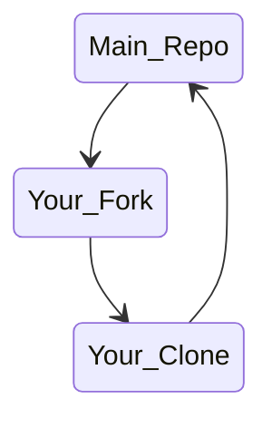

# ssc_stuco
This repository houses the planning and bid documents for sections interested in hosting a student conference.

PRs or merges to `main` will trigger the repo to compile both documents. They will appear as an artifact of the run.

## How to Compile

After you have cloned this repository and added your content, enter the planning or proposal folder and run the command *make {insert type here}*.

For pdf, insert *all-via-pdf* or *all*.

For dvi, insert *all-via-dvi*.

For epub, insert *epub*.

For zip, insert *zip*.

*Note: Do not include the {} from the make command line, replace the whole {insert type here} text with the command corresponding to the correct file type.*

Ex: To make as a pdf, the full command should be: `make all-via-pdf`

### To clean your local directory run:

`make clean` or `make realclean`

## Committing to git
This repo has a file instructing git to ignore all of the files generated from compiling, that is intentional.
To learn more about setting up git go to [https://swcarpentry.github.io/git-novice/02-setup.html](https://swcarpentry.github.io/git-novice/02-setup.html).

Make sure that you are making changes on a branch other than main. Before you make any changes:
1. add upstream remote with `git remote add upstream git@github.com:nsryan2/ssc_stuco.git` (you only have to do this once)*,
2. make sure you're on the main branch with `git checkout main`,
3. pull changes from the upstream to your main branch with `git pull upstream main`,
4. create a new branch with `git checkout -b branch_name`,
5. make changes,
6. add your changes with `git add file_name` (where file_name is where you made changes),
7. commit your changes with `git commit -m "your commit message, summarize what you did"`,
8. push to your fork with `git push origin branch_name`,
9. and the go to github and make a PR from your fork to the main repo.

*you can check all of your remotes (or connections to github) by running `git remote -v`, this will give you the name and link.

Changes should follow this flow path:

Where "Your_Clone" is the version on your machine, "Your_Fork" is the version on your github account, and "Main_Repo" is the one you forked from.

**Please do not merge your own PRs, wait for others to review them.**
